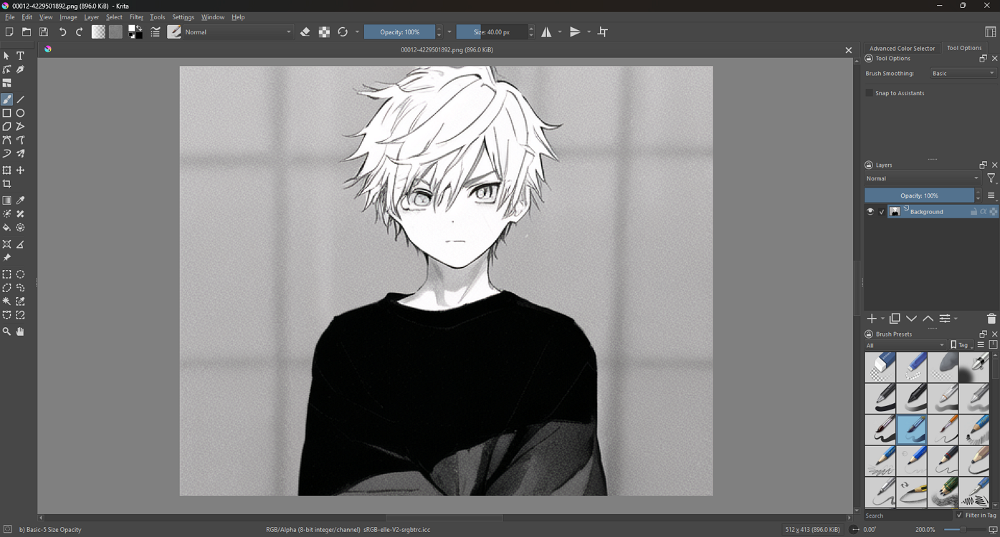
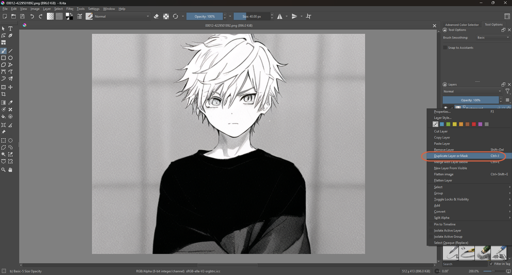
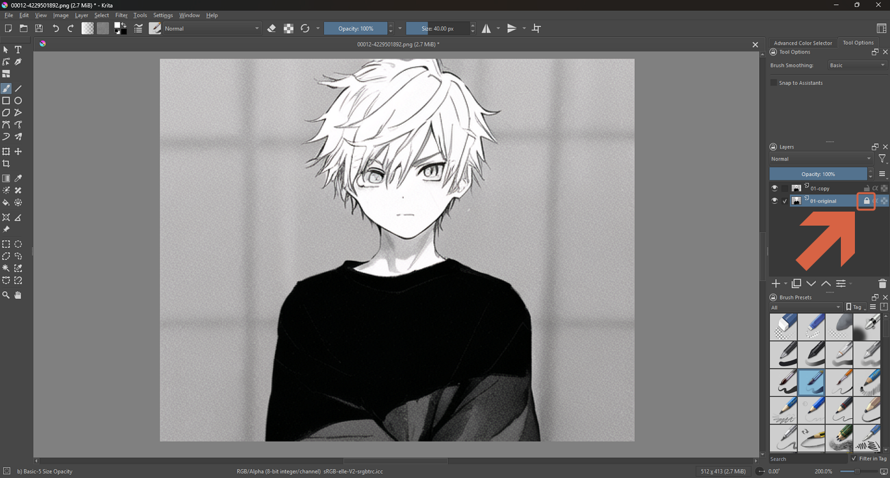
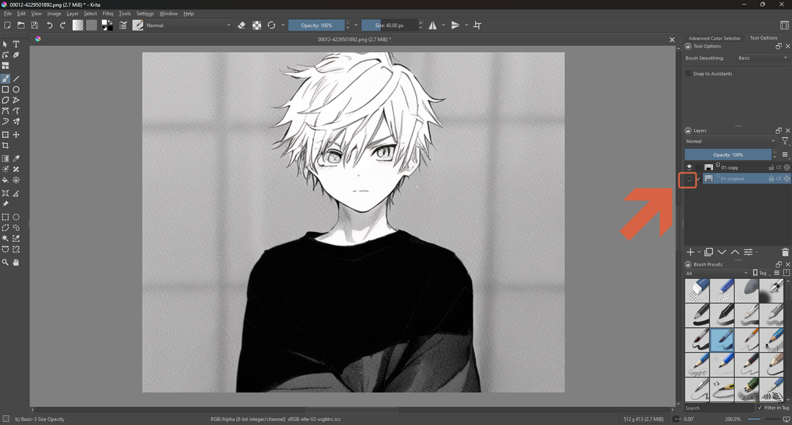
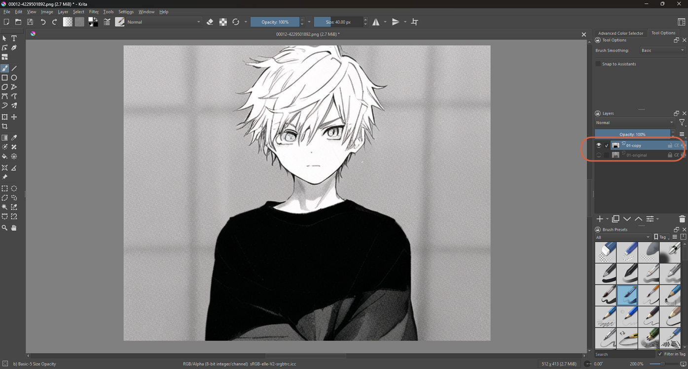
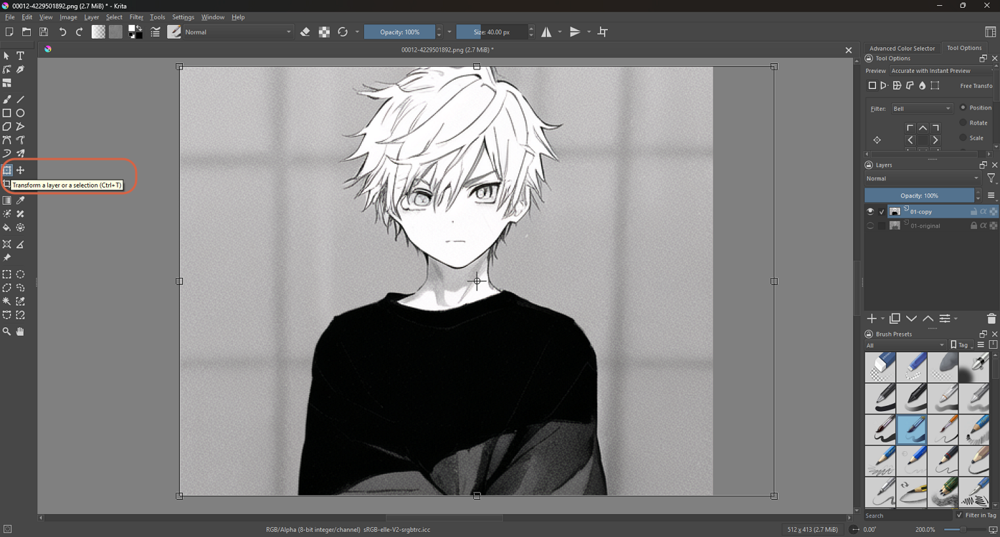
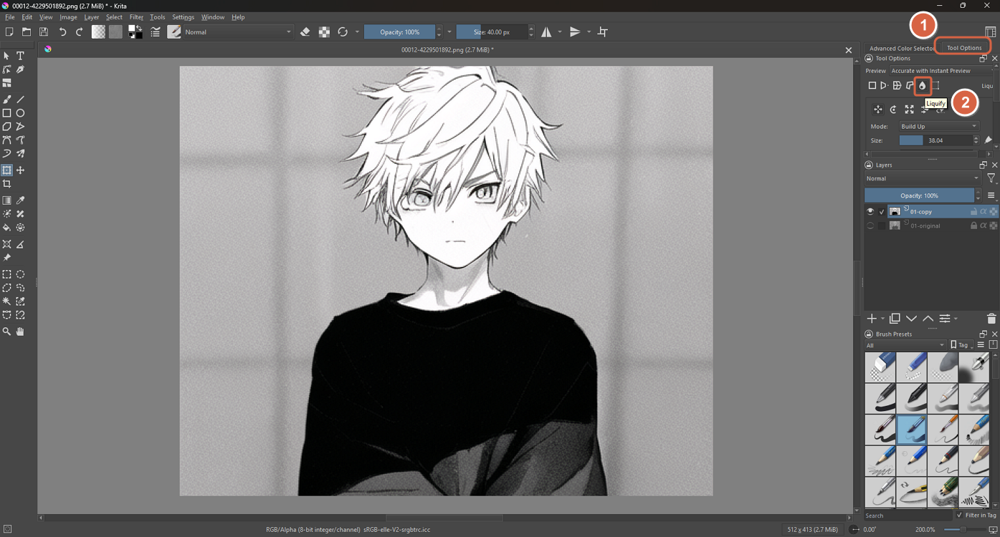
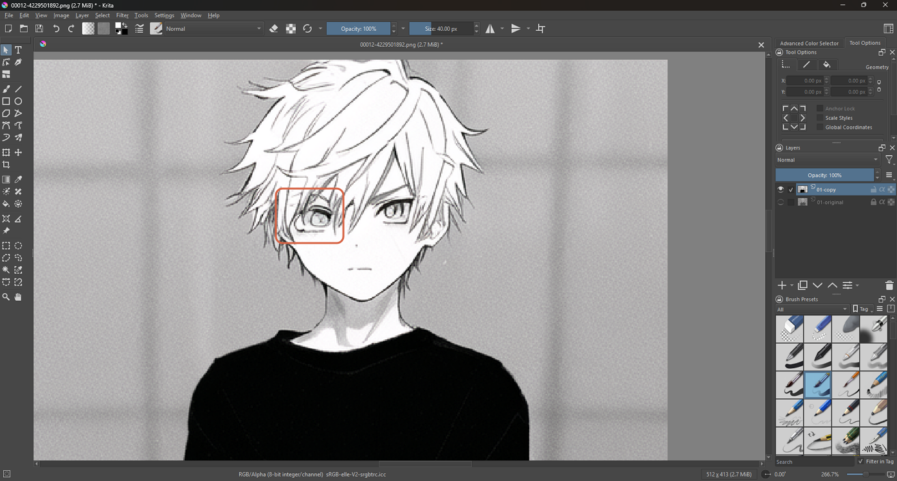
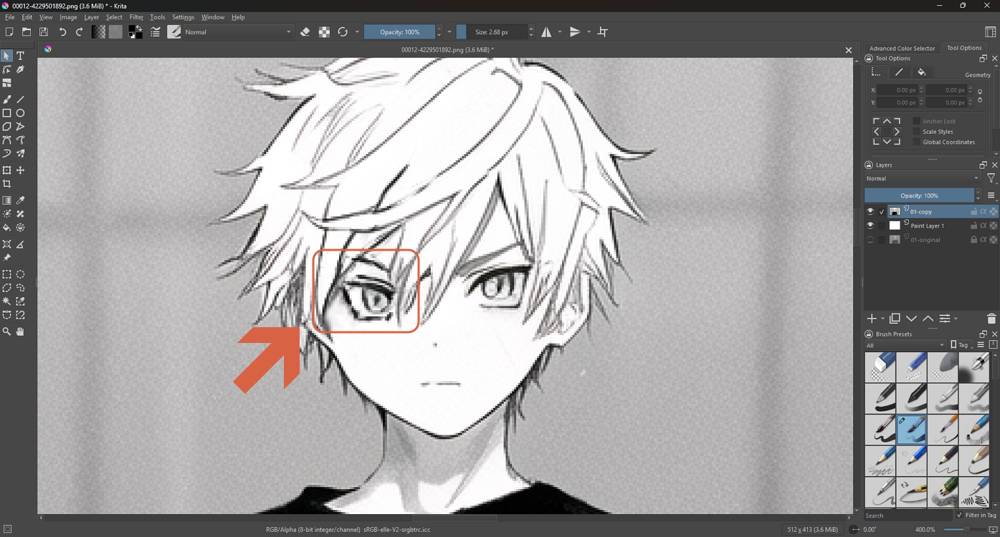

# Reshaping an Object with Liquify

> **Note:** This document was generated by Claude Code and has not been reviewed by a human. Please use it as a reference only.

Liquify changes the pixels of the layer you're on, so work on a copy of your image, switch the Transform tool to Liquify mode, and push and pull part of the picture like clay.

## Step 1: Open Your Image

Open the image in Krita (`Ctrl+O`). It starts with one layer, **Background**. This guide uses a 512 × 413 black-and-white character image and reshapes an eye.

## Step 2: Duplicate the Layer

Right-click the layer in the Layers panel and choose **Duplicate Layer or Mask** (`Ctrl+J`).

## Step 3: Lock the Original

Name the two layers so you can tell them apart (here **01-original** below and **01-copy** above). Select **01-original** and click its **lock** icon.

## Step 4: Hide the Original

Click the **eye** icon on the left of **01-original** to hide it.

## Step 5: Select the Copy

Click **01-copy** so it's the active layer. Everything you do next happens on this layer.

## Step 6: Choose the Transform Tool

In the toolbox, click **Transform a Layer or a Selection** (`Ctrl+T`). Handles appear around the layer.

## Step 7: Switch to Liquify Mode

Open the **Tool Options** tab (1), then click the water-drop **Liquify** icon in the row of transform modes (2). The Liquify options appear below it.

## Step 8: Zoom in on the Area

Zoom in on the part you want to change. Here the left eye (boxed) is the target, at 266.7% zoom.

## Step 9: Drag on the Canvas

Drag over the area with the Liquify brush. Krita deforms the picture along the brush stroke. Make small strokes and check the result as you go.

> **Note:** The Krita manual's Transform page doesn't describe how to apply (commit) a Liquify edit, and this isn't confirmed yet. Update this step once confirmed.

## Liquify Options

The Liquify brush has these modes, in the row of icons under the Liquify button:

| Mode | What It Does |
|---|---|
| Move | Drags the image along the brush stroke. |
| Scale | Grows or shrinks the image under the cursor. |
| Rotate | Twirls the image under the cursor. |
| Offset | Shifts the image under the cursor. |
| Undo | Erases the actions of the other tools. |

And these brush settings:

| Setting | What It Does |
|---|---|
| Mode | **Wash** keeps the effect between none and the Amount. **Build up** keeps adding on while you stay in one place. |
| Size | Brush size. |
| Amount | Brush strength. |
| Flow | Only used by Build up. |
| Spacing | Spacing between the brush dabs. |
| Reverse | Flips the action, e.g. grow becomes shrink. |

> **Note:** Liquify is slow on a lot of data. Working inside a selection, or on a separate layer with little content, speeds it up noticeably.

## References

- [Krita Manual: Transform Tool](https://docs.krita.org/en/reference_manual/tools/transform.html) — official docs.
