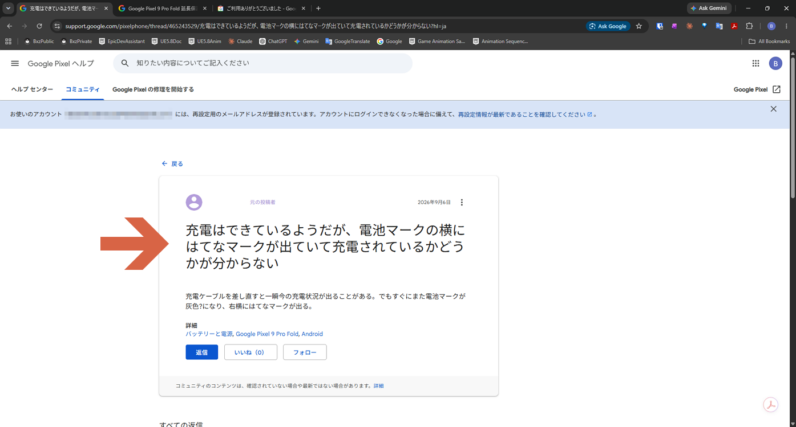
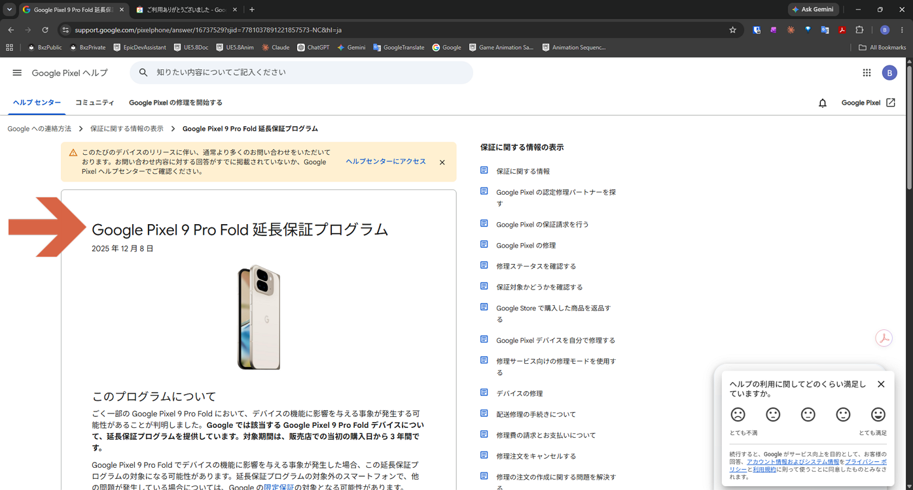
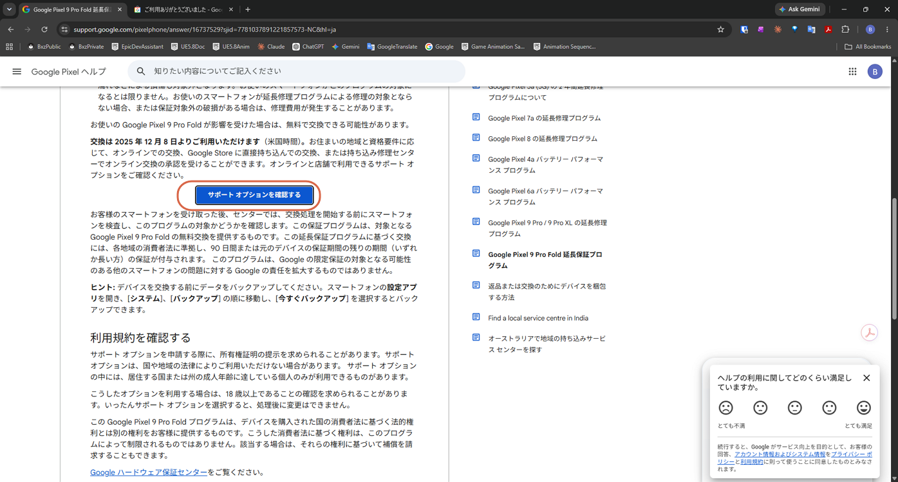
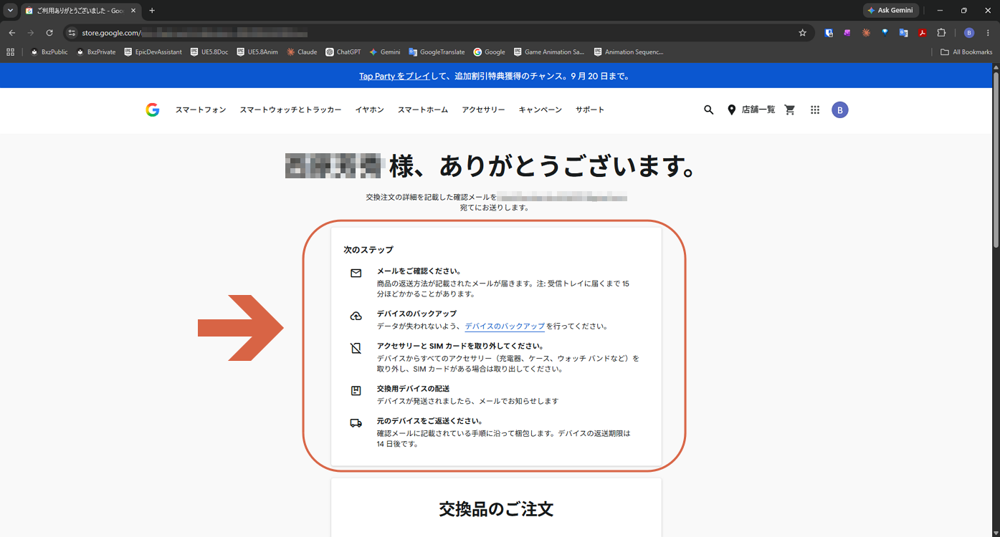
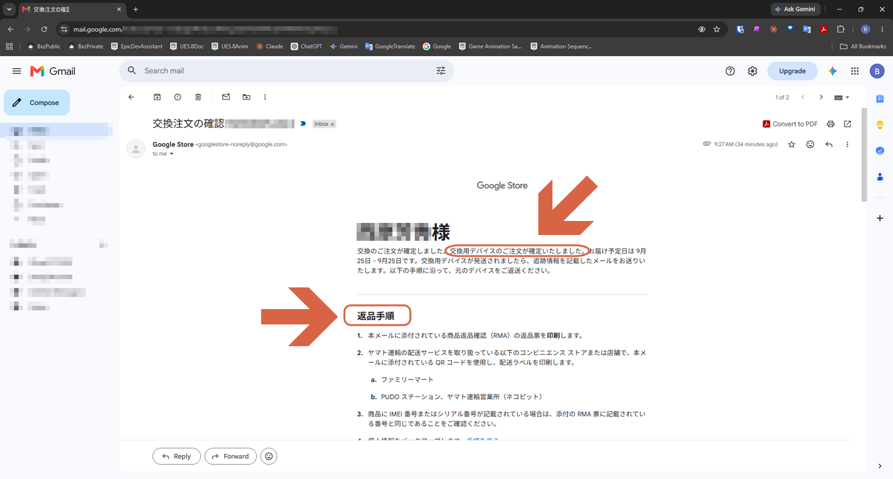
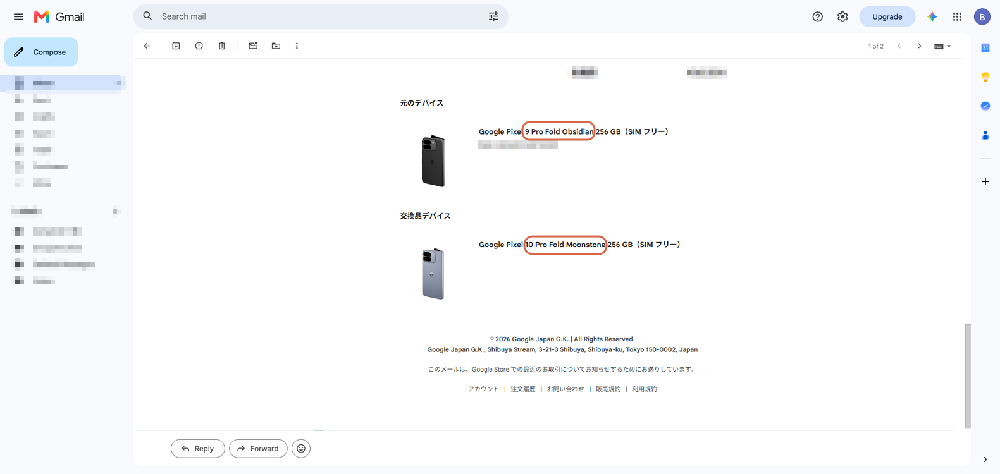
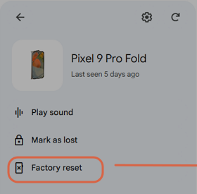
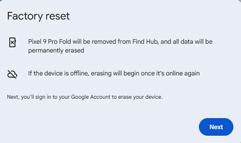

# Replacing a Pixel 9 Pro Fold Under the Extended Warranty Program

> **Note:** This document was generated by Claude Code and has not been reviewed by a human. Please use it as a reference only.

Google offers an extended warranty program for the Pixel 9 Pro Fold: if your phone is affected by an issue that impacts device function, Google may replace it for free for up to 3 years from the original purchase date. This guide follows the replacement request flow on Google's Japan help pages, so the screenshots are in Japanese.

> **Note:** Eligibility, options, and steps vary by region and can change. Always check the [official program page](https://support.google.com/pixelphone/answer/16737529?hl=ja) first.

## Step 1: Find the Program Page

If your phone has a problem — for example, a battery icon that shows a question mark while charging — searching the Google Pixel Community can lead you to the program.

The official page is titled **Google Pixel 9 Pro Fold 延長保証プログラム** (Google Pixel 9 Pro Fold Extended Warranty Program). Key points from it:

- It applies to Pixel 9 Pro Fold devices affected by an issue that impacts device function.
- Coverage runs for 3 years from the original purchase date at the retailer.
- If your phone is affected, you may get a free replacement — online, at a Google Store, or through a walk-in repair center that approves an online replacement.
- After receiving your phone, Google inspects it to confirm it qualifies before processing the replacement.
- The replacement comes with 90 days of warranty, or the remainder of the original warranty, whichever is longer.
- Back up your data first: **Settings** → **System** → **Backup** → **Back up now**.

## Step 2: Check Your Support Options

Scroll down and click **サポート オプションを確認する** (Check Support Options), then go through the process.

## Step 3: Review the Next Steps

When you finish, a confirmation page lists what happens next:

1. **Check your email** — the return instructions arrive there. It can take about 15 minutes to reach your inbox.
2. **Back up your device.**
3. **Remove all accessories and the SIM card** — chargers, cases, watch bands, and so on.
4. **Wait for the replacement to ship** — Google emails you when it's sent.
5. **Return your original device** by following the instructions in the confirmation email. The return deadline is 14 days.

## Step 4: Follow the Confirmation Email

Google Store sends a **交換注文の確認** (Replacement Order Confirmation) email. It confirms the replacement order and its estimated delivery date, then lists the **返品手順** (return steps):

1. Print the return slip (RMA) attached to the email.
2. Use the QR code in the email to print a shipping label at a participating convenience store or shop that handles Yamato Transport shipping — FamilyMart, a PUDO station, or a Yamato Transport office.
3. Make sure the IMEI or serial number on your phone matches the number on the RMA slip.
4. Back up your personal information.

## Step 5: Compare the Original and Replacement Devices

Scroll down in the email to see the **元のデバイス** (original device) and **交換品デバイス** (replacement device).

> **Note:** You can't choose the model or color of the replacement. In this case, a Pixel 9 Pro Fold in Obsidian was replaced with a Pixel 10 Pro Fold in Moonstone.

## Step 6: Erase the Old Phone

If the old phone won't power on — for example, because the battery is dead — you can't erase it from the device itself. Use Google Find Hub instead: select the device, click **Factory reset**, then click **Next** and sign in to your Google Account.

If the phone is offline, erasing starts the next time it comes online.

> **Warning:** A factory reset removes the phone from Find Hub and permanently erases its data. Wait until the replacement has arrived and your data has moved over — if automatic backups were on, you can restore from the last one onto the new phone.

## Reference

- [Google Pixel 9 Pro Fold Extended Warranty Program](https://support.google.com/pixelphone/answer/16737529?hl=ja)
- [Google Find Hub](https://www.google.com/android/find)
