# Streaming a Windows PC to an Android Tablet with Sunshine and Moonlight

> **Note:** This document was generated by Claude Code and has not been reviewed by a human. Please use it as a reference only.

**Sunshine** (host) runs on a Windows 11 PC and streams the screen using the GPU's hardware encoder for low latency. **Moonlight** (client) runs on an Android tablet, receives the stream, and sends touch and pen input back. No cable is needed — both devices only need to be on the same Wi-Fi network.

## Requirements

- Windows 11 PC with Sunshine installed
- Android tablet with Moonlight installed (tested with an XPPen Magic Drawing Pad)
- Both devices on the same Wi-Fi network — a 5 GHz or Wi-Fi 6 network works best, and connecting the PC by Ethernet helps further

> **Note:** Screenshots were taken with Sunshine `v2026.918.174827`, a pre-release version at the time. The steps are the same for other releases.

---

## Step 1: Open the Sunshine Releases Page

Go to the [Sunshine releases page](https://github.com/LizardByte/Sunshine/releases) on GitHub.

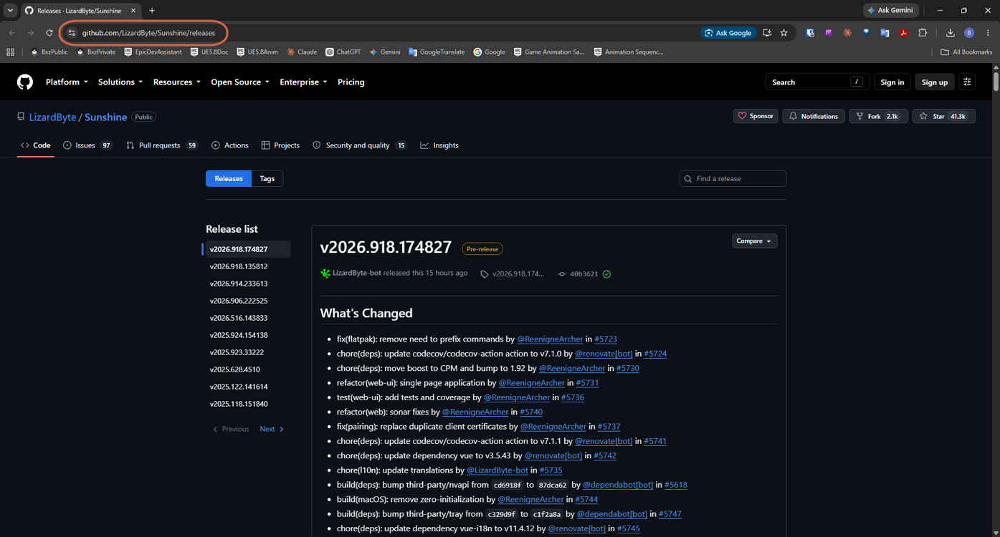

---

## Step 2: Download the Installer

Scroll to **Assets** and download **`Sunshine-Windows-AMD64-installer.msi`**.

- "AMD64" means a normal 64-bit Windows PC (Intel or AMD CPU) — it does not refer to the graphics card. Use the `ARM64` file only on ARM-based PCs.
- Choose the installer rather than `lite.zip`. The portable version can lose control when you interact with administrator-level windows.
- If the newest entry is marked **Pre-release**, look further down the release list for the one with the green **Latest** badge if you prefer a stable build.

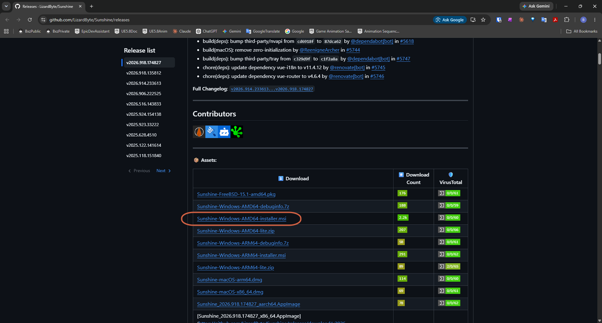

---

## Step 3: Run the Installer

Open the downloaded `.msi` file and click through the wizard:

1. **Welcome** → **Next**

    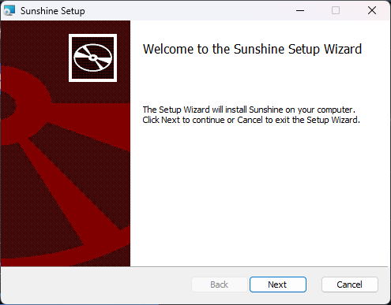

2. **License Agreement** → check **I accept the terms in the License Agreement** → **Next**

    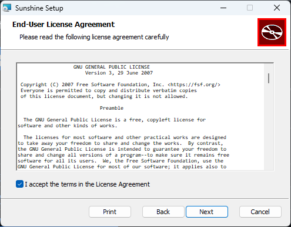

3. **Custom Setup** → keep the defaults → **Next**. The defaults include **Launch on Startup**, so Sunshine starts automatically with Windows.

    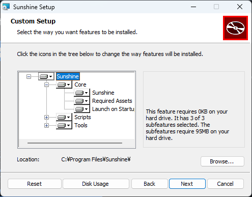

4. **Ready to install** → **Install** (approve the Windows permission prompt)

    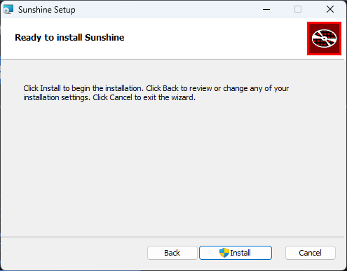

5. **Completed** → **Finish**

    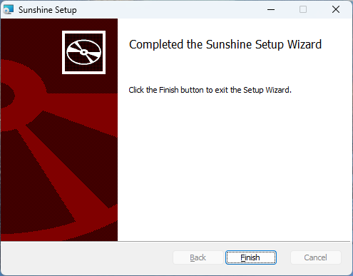

---

## Step 4: Start Sunshine

Press the Windows key, type `sunshine`, and open the **Sunshine** app. A Sunshine icon appears in the system tray, near the clock.

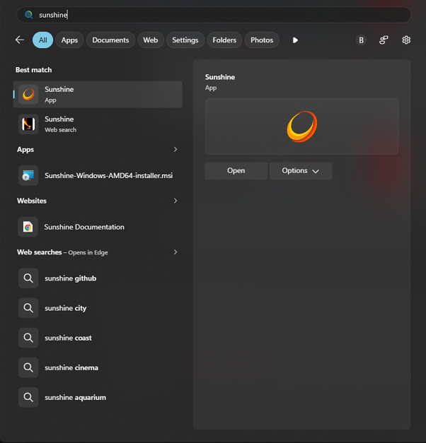

---

## Step 5: Open the Sunshine Web UI

In Chrome, go to **`https://localhost:47990`**.

Chrome shows **"Your connection is not private"** (`NET::ERR_CERT_AUTHORITY_INVALID`). This is expected — Sunshine's page runs on your own PC with a self-signed certificate, which Chrome does not recognize.

1. Click **Advanced**.

    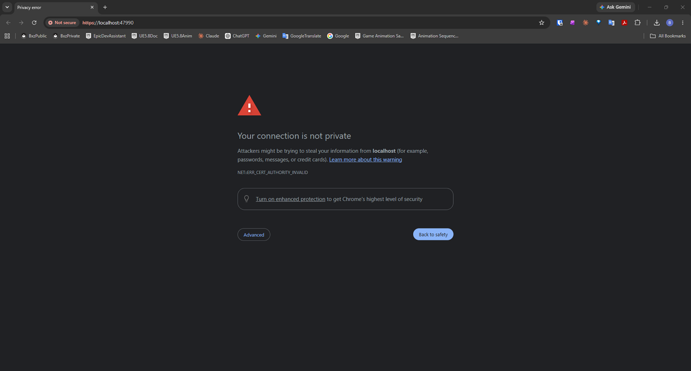

2. Click **Proceed to localhost (unsafe)**.

    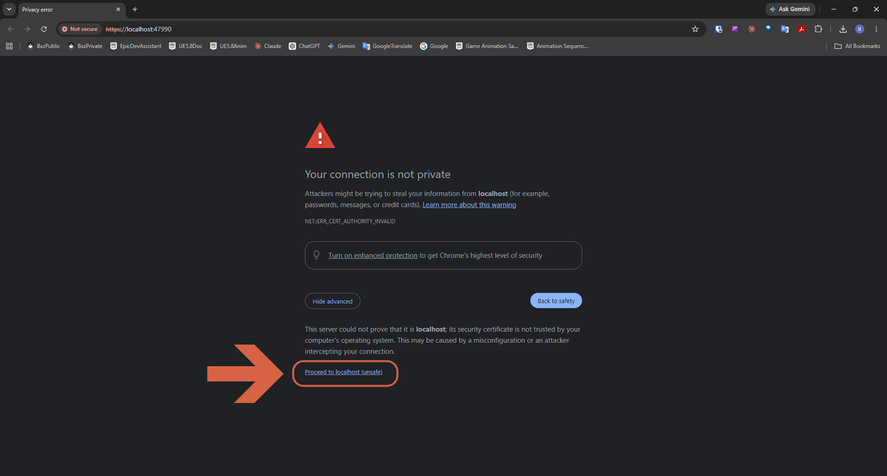

---

## Step 6: Create the Login

The first time you open the page, Sunshine asks you to create a **username and password**. Any values work — they only protect this local page, so just remember them.

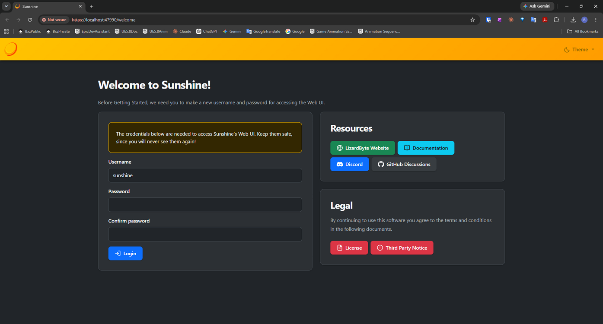

> **Note:** After you click **Login**, Chrome shows its own native **Sign in** prompt (separate from the page you just filled in). Enter the same username and password again to continue.

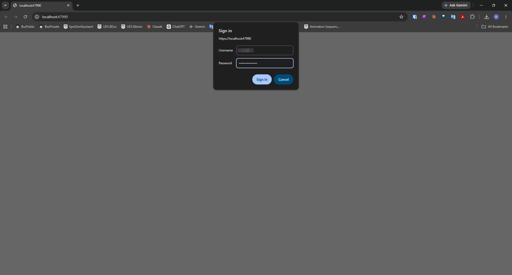

You are signed in when the **"Hello, Sunshine!"** home page appears.

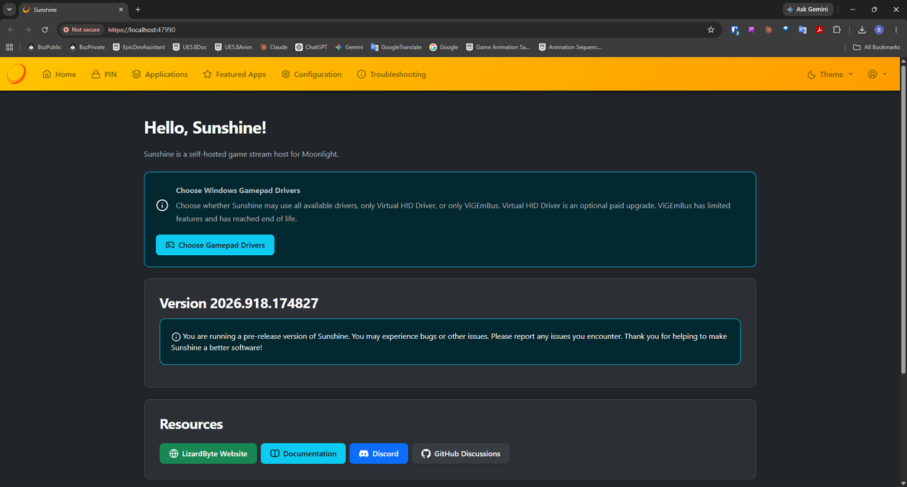

---

## Step 7: Install Moonlight on the Tablet

On the tablet, install **Moonlight Game Streaming** from Google Play. Other download options, including Amazon Appstore and F-Droid, are listed at [moonlight-stream.org](https://moonlight-stream.org).

> **Warning:** Do not install the Windows version of Moonlight on the PC for this setup. It is a client, and the PC is the host.

---

## Step 8: Connect to the Same Wi-Fi

Connect the tablet to the same network as the PC.

---

## Step 9: Find the PC

Open Moonlight. The PC should appear automatically. If it does not, tap **+** and enter the PC's IP address.

---

## Step 10: Get the PIN on the Tablet

Tap the PC in Moonlight. A dialog appears with a 4-digit PIN. The PIN expires after a short time, so do the next step right away — if it times out, tap the PC again to get a new one.

---

## Step 11: Enter the PIN in Sunshine

1. On the PC, open `https://localhost:47990` and sign in.
2. Click the **PIN** tab.
3. Enter the 4-digit PIN from the tablet and give the device any name, for example `Magic Drawing Pad`.
4. Click **Send**.

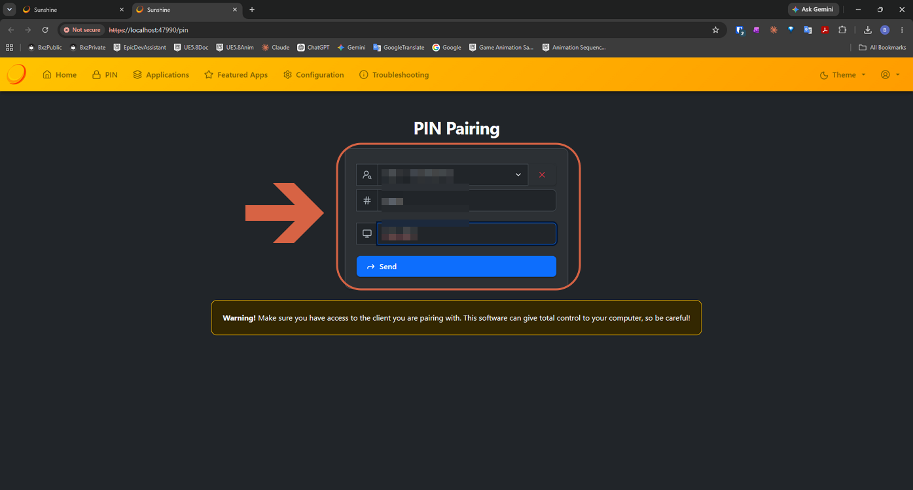

When it works, the page shows **"Success! Please check Moonlight to continue"** and the lock icon disappears from the PC entry on the tablet.

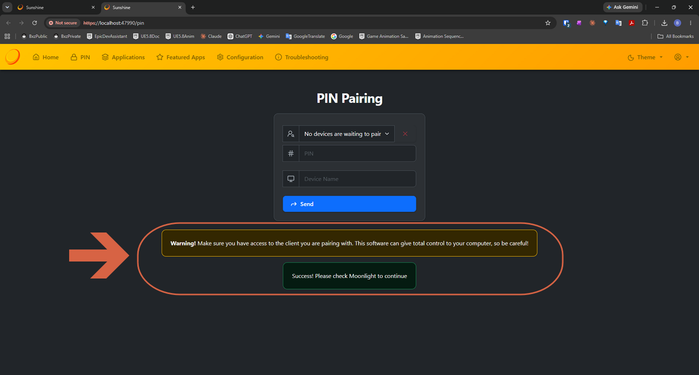

---

## Step 12: Start Streaming

In Moonlight, tap the PC and choose **Desktop**. Your Windows 11 desktop appears on the tablet.

**Suggested starting settings**, in Moonlight's settings, before connecting:

| Setting | Start With |
|---|---|
| Resolution / FPS | 1080p, 60 fps, then raise if Wi-Fi holds up |
| Bitrate | 30-50 Mbps on 5 GHz Wi-Fi |
| Touch mode | Direct touch (the pen acts where it touches) |

---

## Troubleshooting

- **The PC does not appear in Moonlight?** Check that both devices are on the same Wi-Fi and that the Windows network profile is **Private**. Then add the PC manually by IP address.
- **Still not found?** Allow `sunshine.exe` in **Windows Security** → **Firewall & network protection** → **Allow an app through firewall**. The installer normally adds this itself.
- **PIN is rejected or times out?** Tap the PC in Moonlight again to get a fresh PIN and enter it quickly.
- **Colors differ from the PC screen?** Turn off HDR and Night Light in Windows. On the tablet, use a natural color mode and turn off eye-comfort or blue-light filters. Try another video codec in Moonlight.

> **Note:** Port forwarding is only needed for streaming from outside your home network — it is not needed on the same Wi-Fi.

---

## Known Limitations

- Pen pressure in Blender through Moonlight has not been verified. If pressure does not respond, set **Edit** → **Preferences** → **Input** → **Tablet API** to **Windows Ink** in Blender and test again.
- [SpaceDesk](../spacedesk/connect-disconnect-spacedesk.md) showed better colors in testing, and its Android viewer supports pressure-sensitive pens — it is worth comparing for pen-heavy workflows.

---

## Resources

| Resource | Link |
|----------|------|
| Sunshine releases | https://github.com/LizardByte/Sunshine/releases |
| Sunshine documentation | https://docs.lizardbyte.dev/projects/sunshine/latest/ |
| Moonlight | https://moonlight-stream.org |
| Japanese setup article | https://qiita.com/niuind/items/c2b789659b38839f3bd4 |
