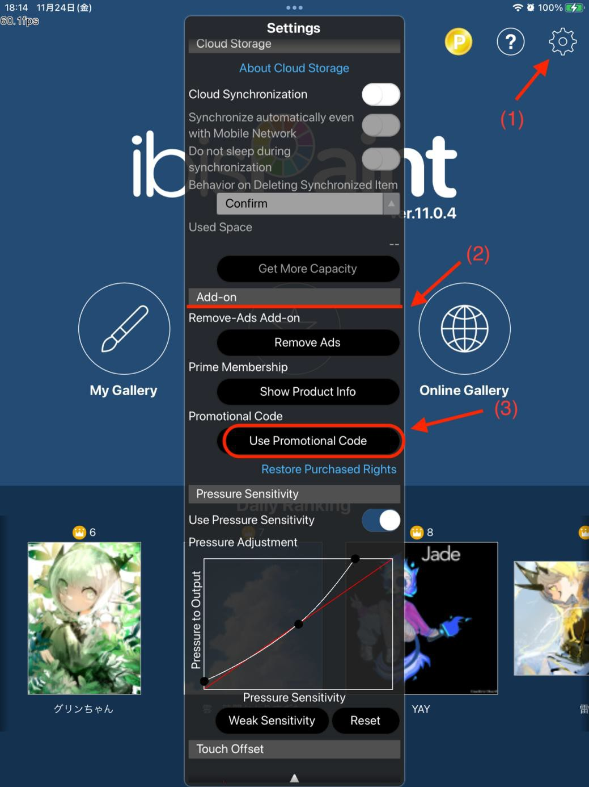
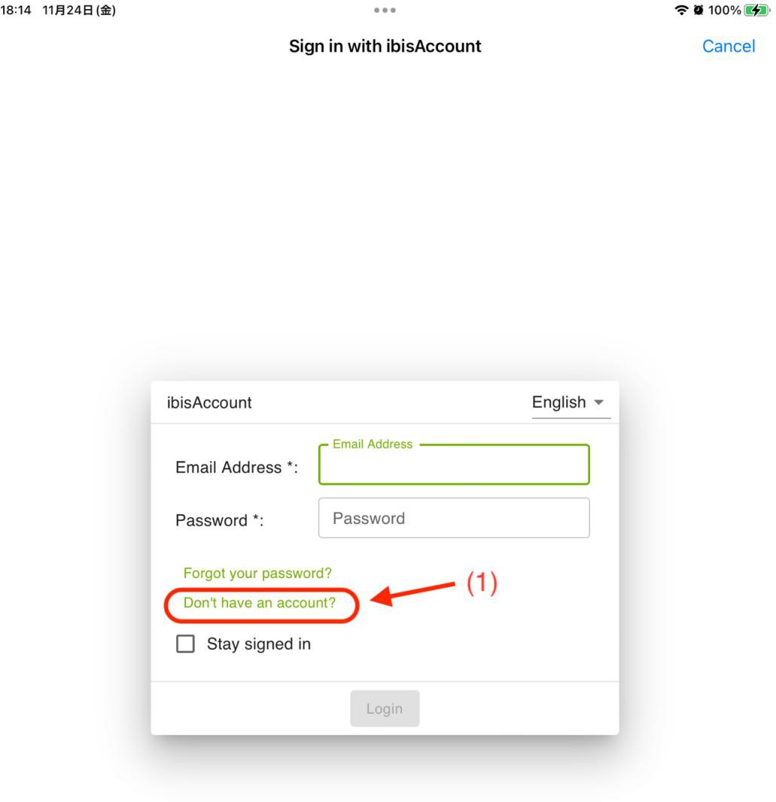
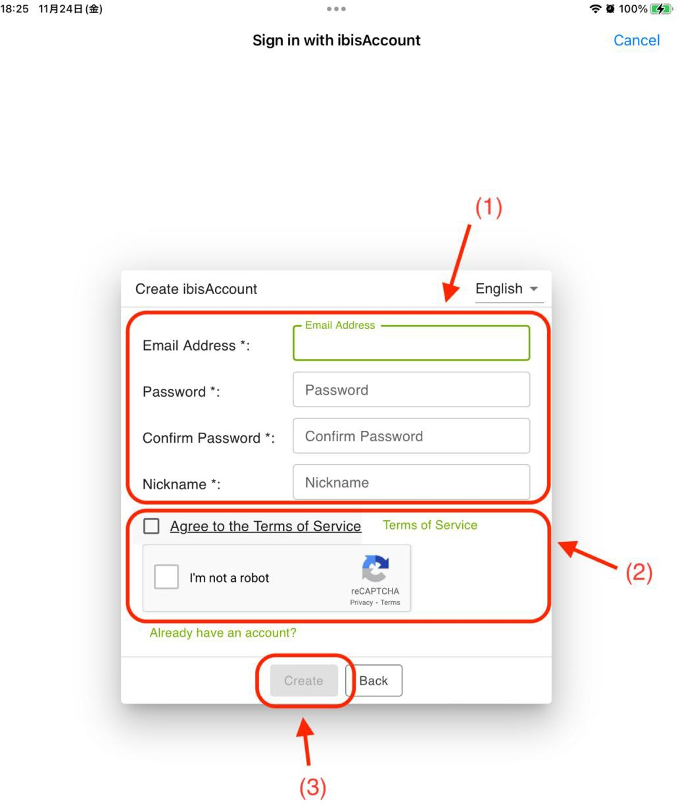
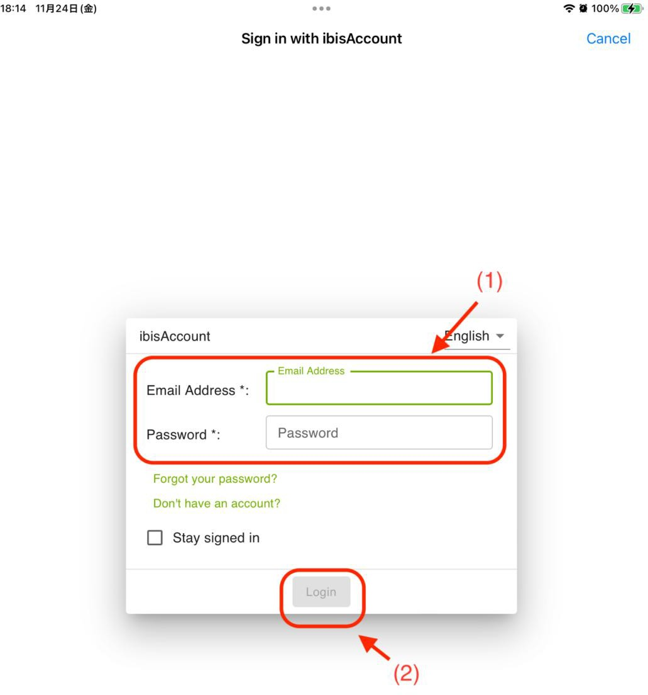
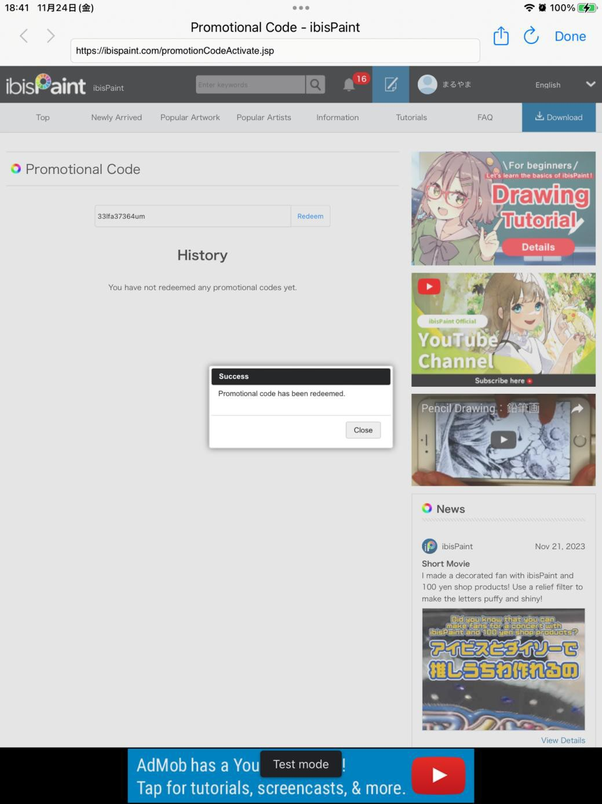

# Redeeming ibis Paint X Membership

> **Note:** This document was generated by Claude Code and has not been reviewed by a human. Please use it as a reference only.

XPPen Magic Drawing Pad owners can redeem a free ibis Paint X membership using a code obtained from the XPPen website.

> **Note:** ibis Paint X must be version V11.1.1 or later. Update the app on Google Play if needed.

## Step 1: Get a Membership Code

Open the XPPen free drawing software page, select **ibis Paint X**, and go to the details page. Register an XPPen account as prompted, enter your device serial number and other required information, and receive your membership code.

## Step 2: Open the Redemption Screen

On the tablet, open ibis Paint X. Tap the **Settings** button in the upper-right corner, scroll down to find **Additional Features**, and tap **Use Membership Code**.

## Step 3: Create or Log In to an ibis Account

If you do not have an ibis account, tap **Don't have an account yet?** to register.

Enter your email, password, and nickname. Check the box to agree to the Terms of Service, complete any verification, and tap **Create**.

If you already have an ibis account, log in directly and skip to Step 4.

## Step 4: Redeem the Code

Log in to your ibis Paint X account.

Enter the membership code from Step 1 and tap **Redeem**. A pop-up window confirms the redemption was successful.

